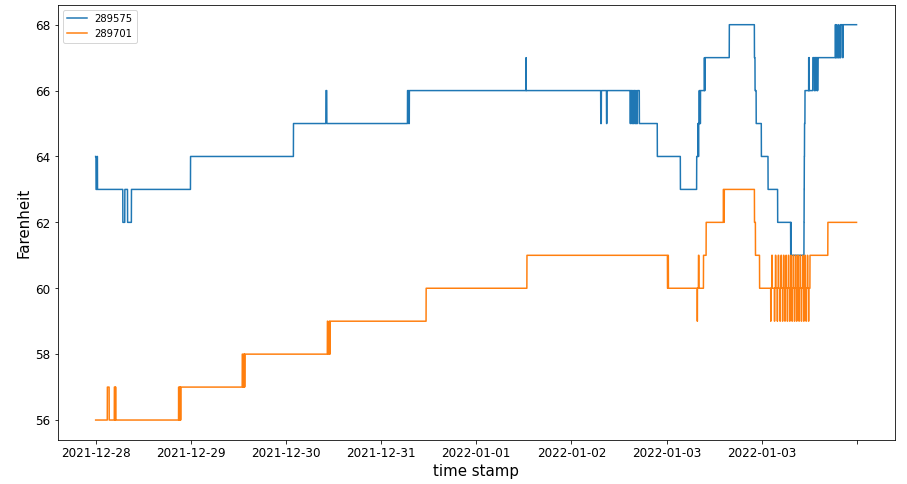

Querying Building-Specific Data
===============================

Querying Building Equipment
---------------------------

Using the API, we can retrieve the data from all the buildings that belong to our organization:

    >>> # Get a list of all the buildings under your Organization
    >>> pd.json_normalize(client.get_all_buildings())
        id  org_id             name  ... point_count info.note info
    0   66       6   T`Challa House  ...          81            NaN
    1  427       6  Office Building  ...        4219       NaN  NaN
    2  428       6       Laboratory  ...        2206       NaN  NaN
    3  429       6      Residential  ...        4394       NaN  NaN

The first column of this dataframe ('id') contains the building identifier number.

In order to retrieve the equipment for a particular building (e.g. Laboratory, id: 428), we use client.get_building_equipment():

    >>> # Get a list of all equipment in a building
    >>> pd.DataFrame(client.get_building_equipment(428))

Querying Specific Points
------------------------

In order to query specific points, first we need to import the PointSelector class:

    >>> # Set parameters for querying sensor data
    >>> from onboard.client.models import PointSelector
    >>> query = PointSelector()

There are multiple ways to select points using the PointSelector. The user can select all the points that are associated with one or more lists containing any of the following:

    organizations
    buildings
    point_ids
    point_names
    point_hashes
    point_ids
    point_names
    point_topics
    equipment
    equipment_types

For example, here we make a query that returns all the points of the type 'Real Power' OR of the type 'Zone Temperature' that belong to the 'Laboratory' building:

    >>> query = PointSelector()
    >>> query.point_types = ['Real Power', 'Zone Temperature']
    >>> query.buildings = ['Laboratory']
    >>> selection = client.select_points(query)

We can add to our query to e.g. further require that returned points must be associated with the 'fcu' equipment type:

    >>> query = PointSelector()
    >>> query.point_types = ['Real Power', 'Zone Temperature']
    >>> query.equipment_types = ['fcu']
    >>> query.buildings = ['Laboratory']
    >>> selection = client.select_points(query)
    >>> selection
    {'buildings': [428],
    'equipment': [27356, 27357],
    'equipment_types': [9],
    'orgs': [6],
    'point_types': [77],
    'points': [289701, 289575]}

In this example, the points with ID=162801, and 162795 are the only ones that satisfy the requirements of our query.

We can get more information about these points by calling the function get_points_by_ids() on selection['points']:

    >>> # Get Metadata for the sensors you would like to query
    >>> sensor_metadata = client.get_points_by_ids(selection['points'])
    >>> sensor_metadata_df = pd.DataFrame(sensor_metadata)

Based on the information about these points, we can observe that none of the points of our list belongs to the point type 'Real Power', but only to the point type 'Zone Temperature'

sensor_metadata_df now contains a dataframe with rows for each point, and the following columns:

    >>> ['id', 'building_id', 'last_updated', 'first_updated', 'device',
    >>>  'network_device', 'objectId', 'name', 'description', 'units',
    >>>  'tagged_units', 'raw_unit_id', 'value', 'type', 'point_type_id',
    >>>  'measurement_id', 'datasource_hash', 'topic', 'state_text', 'equip_id']

Exporting Data to .csv
---------------------

Data extracted using the API can be exported to a .csv or excel file using Pandas:

    >>> # Save Metadata to .csv file
    >>> sensor_metadata_df.to_csv('~/metadata_query.csv')

Querying Time-Series Data
-------------------------

To query time-series data first we need to import modules from datetime, models and dataframes.

    >>> from datetime import datetime, timezone, timedelta
    >>> import pytz
    >>> from onboard.client.models import TimeseriesQuery, PointData
    >>> from onboard.client.dataframes import points_df_from_streaming_timeseries

We select the range of dates we want to query, in UTC format:

    >>> # Enter Start & End Time Stamps in UTC
    >>> # Example "2018-06-03T12:00:00Z"
    >>>
    >>> # get data from the past week
    >>> start = datetime.now(pytz.utc) - timedelta(days=7)
    >>> end = datetime.now(pytz.utc)

Now we are ready to query the time-series data for the points we previously selected in the specified time-period

    >>> # Get time series data for the sensors you would like to query
    >>> timeseries_query = TimeseriesQuery(point_ids = selection['points'], start = start, end = end)
    >>> sensor_data = points_df_from_streaming_timeseries(client.stream_point_timeseries(timeseries_query))

This returns a dataframe containing columns for the timestamp and for each requested point.

Here, we set the timestamp as the index and forward fill the data for plotting

    >>> sensor_data_clean = sensor_data.set_index('timestamp').astype(float).ffill()
    >>>
    >>> # Edit the indexes just for visualization purposes
    >>> indexes = [i.split('T')[0] for i in list(sensor_data_clean.index)]
    >>> sensor_data_clean.index = indexes
    >>>
    >>> fig = sensor_data_clean.plot(figsize=(15,8), fontsize = 12)
    >>>
    >>> # Adding some formatting
    >>> fig.set_ylabel('Farenheit',fontdict={'fontsize':15})
    >>> fig.set_xlabel('time stamp',fontdict={'fontsize':15})

